# Lightx 安全扫描工具


<div align="center">
    <h3>Lightx——轻量级网络安全扫描与漏洞检测工具</h3>
    <a href="https://github.com/onewinner/Lightx/releases/"></a><a href="https://github.com/onewinner/Lightx/releases/"></a>
</div>


## 项目简介

Lightx 是一款轻量级、高效率的网络安全扫描工具，专为企业安全建设者和渗透测试工程师设计。它集成了端口扫描、服务识别、Web指纹识别、漏洞扫描和弱口令检测等功能，提供全面的安全评估能力，并覆盖多数两高一弱场景。

### 主要特点

- **多目标扫描**：支持单个URL/IP、IP段、域名和文件列表等多种输入方式
- **高效端口扫描**：快速识别开放端口和服务类型
- **Web指纹识别**：精准识别Web应用程序、框架、CMS等技术栈
- **漏洞检测**：基于Nuclei（nuclei3.35）SDK引擎，支持多种漏洞检测能力
- **弱口令检测**：内置多种服务的弱口令爆破插件
- **插件化架构**：易于扩展的插件系统，支持自定义安全检测模块
- **美观的HTML报告**：生成详细、直观的扫描结果报告
- **低资源占用**：优化的性能设计，适合在资源有限的环境中运行
- **全网最全国产数据库检测支持**: **支持对DM达梦、Kingbase人大金仓、GaussDB高斯、TiDB、Xugu虚谷数据库、Gbase8s南大通用、Shentong神通、OceanBase海扬数据库、TdengineDB涛思时序数据库弱口令检测等等**
- **实时进度条显示**：对于每项任务都能根据任务完成量显示进度条
- **域名扫描增强**：支持直接域名扫描和解析IP扫描两种模式
- **CDN和WAF检测**：自动识别CDN保护和WAF防护，支持真实IP发现
- **IPv6支持**：支持IPv6地址扫描和优先级设置
- **泛解析检测**：自动检测域名泛解析，提高扫描准确性

### 支持插件

Lightx支持以下服务的插件：

- **数据库服务（31种）**：MySQL（兼容MariaDB、OceanBase海扬数据库 、TaurusDB数据库、PolarDB-X数据库）、MSSQL、PostgreSQL（兼容GaussDB高斯、Greenplum、PolarDB-PG数据库、Vastbase G100海量数据、Panweidb中国移动磐维数据库）、Oracle、MongoDB、Redis、Cassandra、Neo4j（兼容TuGraph DB图数据库）、达梦(DM)、人大金仓(Kingbase)、TiDB、clickhouse、Xugu虚谷数据库、DB2数据库、Gbase8s南大通用数据库、Shentong神通数据库、TdengineDB涛思时序数据库、Iotdb时序数据库、InfluxDB时序数据库、Sybase、CouchDB
- **远程管理（6种）**：SSH、RDP、Telnet、VNC、ADB、WinRM
- **Web服务（2种）**：Tomcat AJP、Elasticsearch
- **文件传输（4种）**：FTP、SMB、RSYNC、SVN
- **邮件服务（3种）**：SMTP、POP3、IMAP
- **消息队列（4种）**：RabbitMQ、Kafka、ActiveMQ、MQTT
- **云原生/容器（4种）**：Docker、Kubernetes、Etcd、Consul
- **物联网协议（3种）**：CoAP、MQTT、Modbus
- **分布式缓存（2种）**：Hazelcast、Memcached
- **其他服务（7种）**：LDAP、SNMP、SOCKS5、ZooKeeper、JDWP、RMI、RTSP、RADIUS
- **安全检测（4种）**：MS17010漏洞扫描、NetBIOS信息探测、MongoDB CVE-2025-14847漏洞、网络信息探测

**总计：70种服务，插件总计60个（其中多个插件支持多类服务）**

### 作者附言

本项目设计初衷是为了满足日常检查工作需要和企业安全建设，提供全面的企业内网自查能力，并能应用在少部分攻防场景，由于本工具使用了最新的go版本1.25，所以在系统兼容层面就舍弃了很多（之前想过降级为1.20，但好多依赖库全都得重新修改不然无法编译，比如nuclei，在设计之初那时最新的版本是nuclei，后续也未升级过）这也意味着在攻防内网场景使用非常受限，对于笔者来说是能接受的。在未开发这款工具之前笔者一直使用开源的fscan和dddd，这两款工具想必不用多说yyds，但后来由于dddd作者停更，工具也渐渐无法满足使用需求，于是有了开发这款工具的想法，设计之初也是参考了fscan和dddd，但后面基本全部重构过，形成了工具独特的插件系统。

对于web指纹和指纹漏洞调用没像dddd那样保留workflow的调用设计，而是采用nuclei自身的tags标签调用，这块感谢qiwentaidi/Slack，web指纹扫描这块主要参考了qiwentaidi/Slack的设计（舍弃httpx），以及公开版的POC也是采用该项目，其实内部自己有一个维护的POC库数量4500+，但由于某些原因无法对外开放，当然工具保留了自定义POC的功能，会优先使用本地config目录里的POC和指纹，可以在此新增POC。

最核心漏洞扫描的采用的是nuclei-sdk 3.35版本,最开始参考dddd时其内置nuclei版本为3.0.2且不是采用sdk开发的而是另一种方式，并且作者修改了一些逻辑，当时为了使用最新的nuclei版本就并未采用其设计，而是sdk方式调用，当时和qiwentaidi/Slack作者交流过sdk方式在某些功能性方面有些许限制，比如多线程下无法开启代理、自定义dnslog等等参数配置、POC无法采用embed方式内嵌调用等等否则都会报错，这点在Slack和无影上都有体现，工具最开始几个版本也是这样，但后续经过几层迭代也修改了部分nuclei引擎代码逻辑，强制在多线程下开启了更多配置项（目前内部使用半年没有啥大问题），也修改了POC调用逻辑从最开始工具会在本地新建POC文件到完全脱离采用embed内嵌使用。

对于端口扫描和端口指纹这块，端口扫描采用go多线程设计，端口指纹直接使用的go-nmap库，保留了像fscan那样未进行端口指纹识别时对于常见服务默认的调用方式，工具设计并未太在意一味的快，所以扫描速度中规中矩，对于大型内网快速探测存活，起初想参考gogo的启发式扫描，但现阶段还未实现，仍采用传统的探测。

工具最后一块拼图就是插件系统了，可以说经过了好几轮重构才到现在的雏形，在最开始使用由于各种库扫描报错导致于扫描中断等问题，经过多次优化已经解决了大部分，但仍会有很多场景会报错导致于扫描暂停，最常见的就是内存溢出，无限刷屏，这点后续还会根据情况优化。许多常见服务的插件也是参考了各种开源项目，但为了避免不断重复造轮子，想着工具得有点自己的特色，于是乎想着从国产方面入手，这一过程并没想象的那么顺利，因为好多国产的数据库官方并未给出明确的go语言的驱动，多数只能采用odbc，所以在有些库扫描时得装驱动才能调用，除了新增国产之外，也还新增了一些内网会遇到的一些非国产数据库以及服务等的爆破功能，这个具体支持哪些上述已经列出，不再多说，对于爆破的用户密码字典在命令行参数方面保留了fscan的-user、-pwd、-usera、-pwda的设计可以直接指定文件工具会自动处理，最近版本为了支持自定义，于是将字典独立出来采用config.yaml方式读取，同样工具会优先使用本地目录下的配置，如果本地没有则使用内嵌的字典。

除了以上核心功能外，工具的日志记录以及报告输出也和其他工具有点不太一样，对于日志这点到没啥太多可说的，目前工具本身只支持生成html报告格式，但在html报告基础上能支持导出markdown、json以及execl格式，对于HTML报告也是经过多轮AI改版，目前报告还有些地方存在bug，但最核心的数据展示等都没有太大问题，也引入了智谱AI分析的能力，对于其API密钥也是直接硬编码在报告在供免费使用（像无影那样）。

目前工具在内部使用了大半年也是在不断完善打磨，在很多使用场景特别是一些企业内网检查时，产出率可以说非常高。当然工具本身其实也还存在许多不足的地方，这点也是需要不断完善，就比如一点工具目前终端输出可能会比较杂乱提示语太多，不过对于关键信息都会着色，这点仁者见仁。关于开源问题，起初是打算开源供各位直接使用二开，但最近圈内一些风气实在太差，各种圈钱工具（特指那种拿别人开源工具AI改一下然后成了付费工具的）数不胜数，也不想自己辛辛苦苦写的工具被拿去卖钱，故暂时不会开源，但供大家能直接使用，后续如果需求多会将插件等模块开放出来。本工具可以说是在造轮子但也有其独特的地方，非常欢迎各位师傅使用、反馈问题以及提出各位宝贵的建议。

## 快速开始

### 基本用法

```bash
# 扫描单个URL
Lightx -t http://example.com

# 扫描IP地址
Lightx -t 192.168.1.1

# 扫描IP段
Lightx -t 192.168.1.1/24

# 扫描域名
Lightx -t example.com

# 从文件读取目标
Lightx -t targets.txt
```

### 常用场景

```bash
# 完整扫描(端口扫描+Web扫描+漏洞检测)
Lightx -t example.com

# 指定端口范围
Lightx -t 192.168.1.1 -p 80,443,8000-9000

# 使用预定义端口列表
Lightx -t 192.168.1.1 -p web  # 扫描Web相关端口

# 排除扫描端口8080
Lightx -t 192.168.1.1 -p web  -pn 8080

# 禁用存活探测(扫描所有IP)
Lightx -t 192.168.1.0/24 --np

# 启用无痕模式(减少WAF检测风险)
Lightx -t example.com --st

# 生成HTML报告
Lightx -t example.com -r report.html

# 禁用web扫描
Lightx -t example.com -noweb

# 禁用插件扫描
Lightx -t example.com -nobr

# 禁用web漏洞探测扫描
Lightx -t example.com -vul=false

# 域名扫描相关
# 直接域名扫描（默认）
Lightx -t example.com

# 解析IP模式扫描
Lightx -t example.com --ra

# 只进行域名解析
Lightx -t example.com --dr

# 跳过CDN保护的域名
Lightx -t example.com --sc

# 强制使用真实IP扫描
Lightx -t example.com --frp

# IPv6优先扫描
Lightx -t example.com --ipv6
```

## 使用截图

### 扫描流程

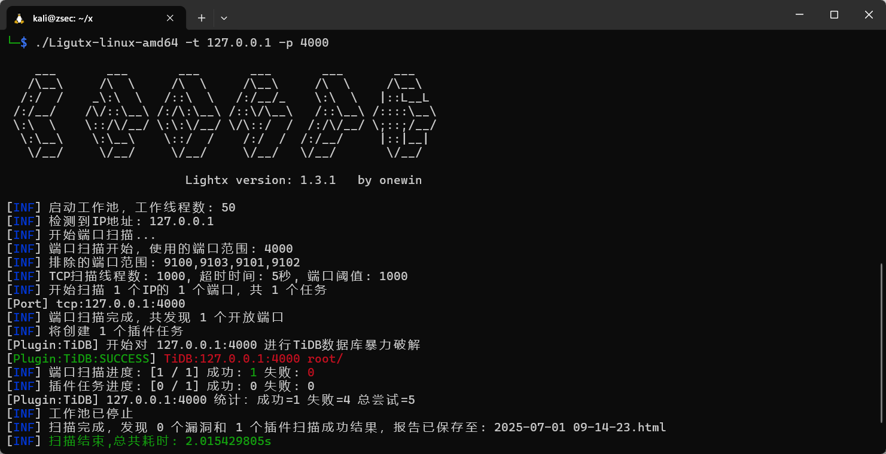

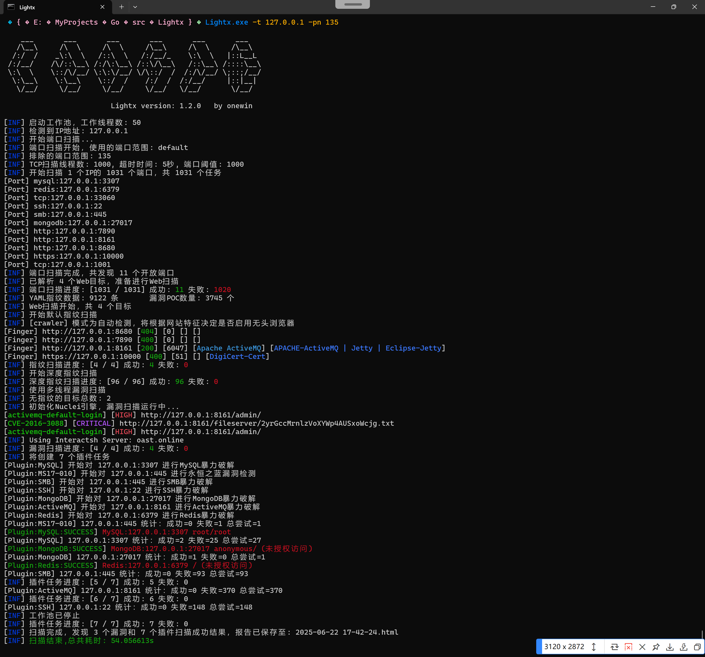

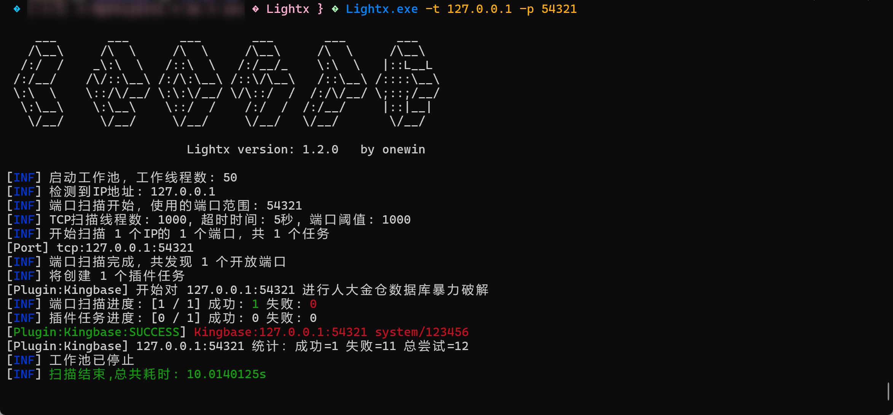

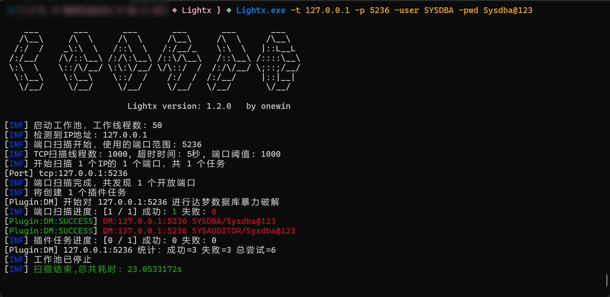

### 扫描结果

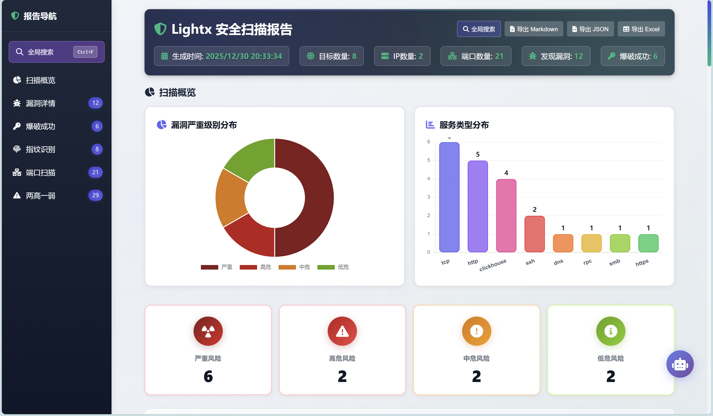

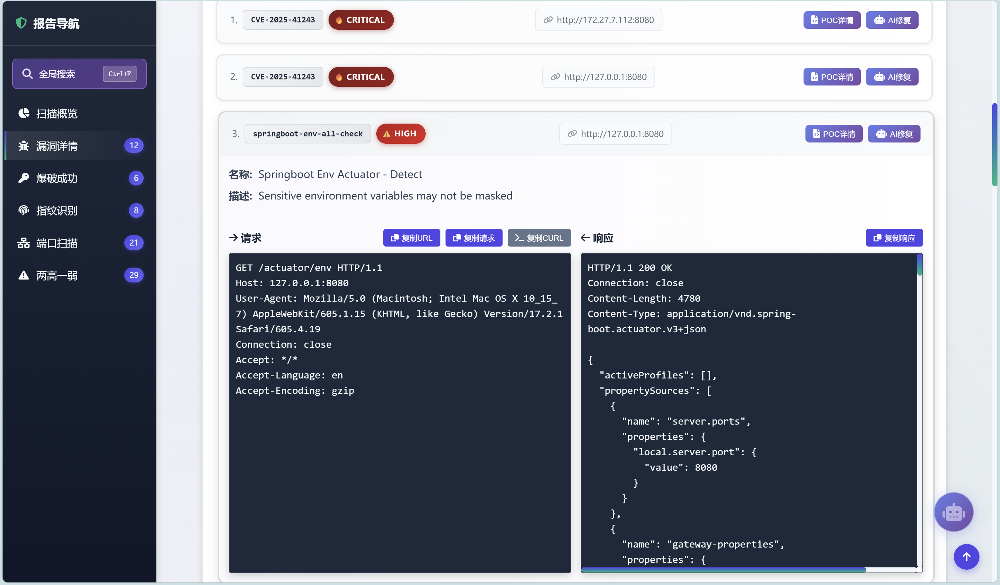

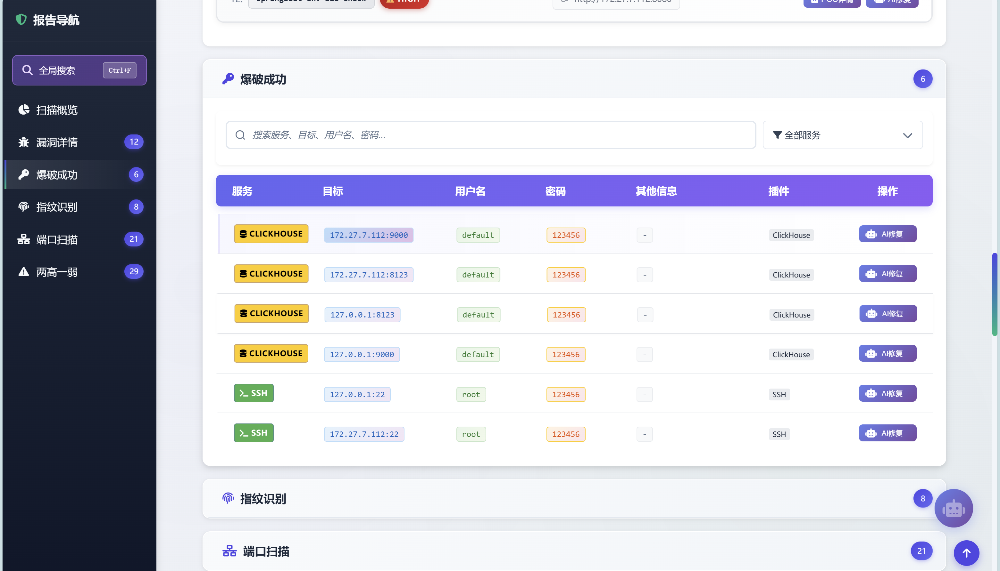

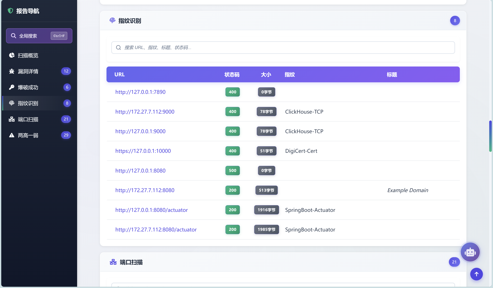

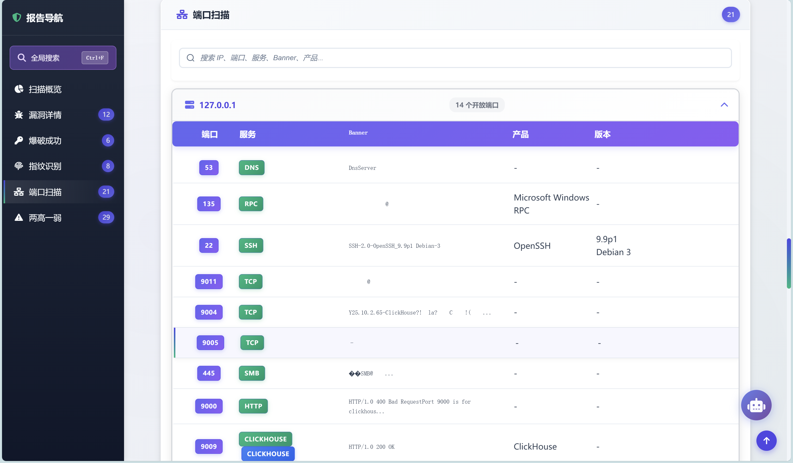

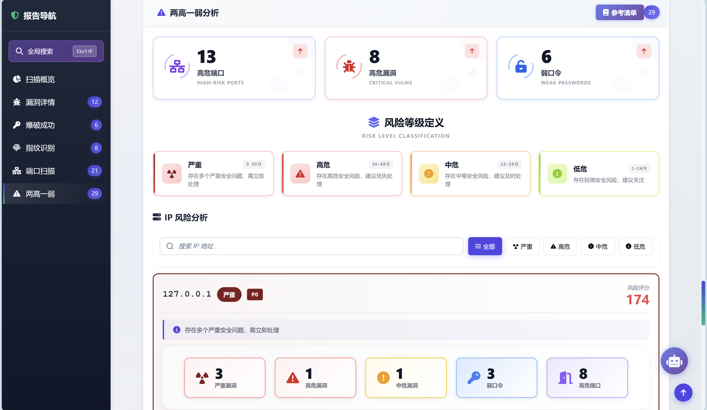

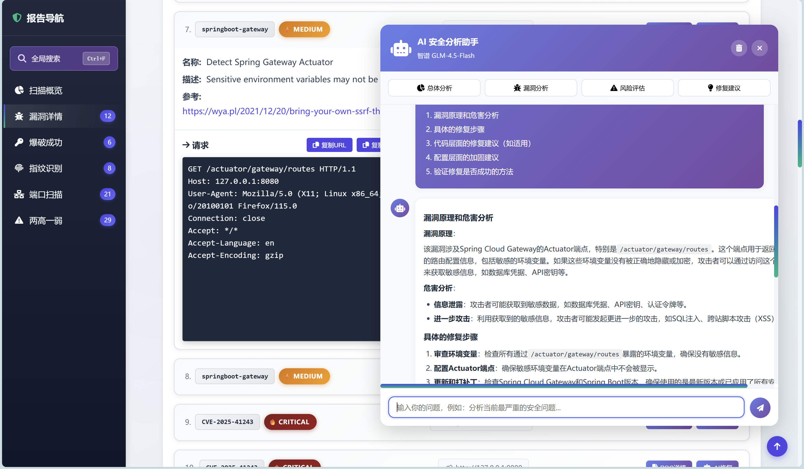

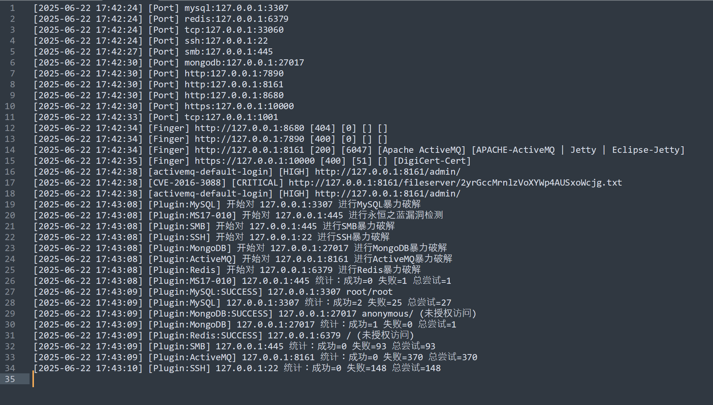


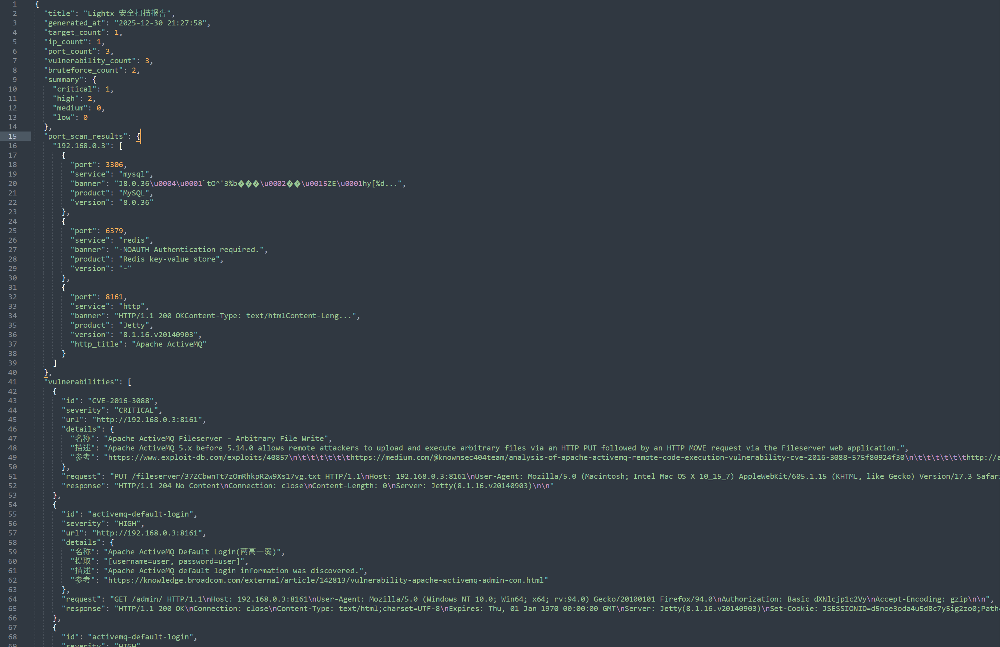


## 参数说明

```
Lightx.exe -h

    ___       ___       ___       ___       ___       ___
   /\__\     /\  \     /\  \     /\__\     /\  \     /\__\
  /:/  /    _\:\  \   /::\  \   /:/__/_    \:\  \   |::L__L
 /:/__/    /\/::\__\ /:/\:\__\ /::\/\__\   /::\__\ /::::\__\
 \:\  \    \::/\/__/ \:\:\/__/ \/\::/  /  /:/\/__/ \;::;/__/
  \:\__\    \:\__\    \::/  /    /:/  /  /:/__/     |::|__|
   \/__/     \/__/     \/__/     \/__/   \/__/       \/__/

                         Lightx version: 1.5.0   by onewin

NAME:
   Lightx - 一款轻量化的Web指纹识别与漏洞扫描工具 / A lightweight web fingerprint identification and vulnerability scanning tool

USAGE:
   Lightx -u http://127.0.0.1

VERSION:
   1.5.0

COMMANDS:
   help, h  Shows a list of commands or help for one command

GLOBAL OPTIONS:
   -t value, --target value                    目标URL或IP地址或IP段或域名 / Target URL, IP address, IP range or domain
   -d, --deep                                  启用深度扫描以检查更多指纹，例如nacos、xxl-job / Enable deepScan to check more fingerprints, e.g nacos, xxl-job (default: true)
   --rp, --root-path                           深度指纹扫描是否采用根路径扫描 / Does the deep fingerprint adopt root path scanning (default: true)
   --vul value, --vulnerability value          禁用漏洞扫描或选择扫描模式 / Disable vulnerability scanning or select scan mode (more: 多线程, one: 单线程，false: 禁用) (default: "more")
   --tp value, --template value                模板文件或目录 / Template file or directory
   --id value, --nuclei-ids value              Nuclei模板ID过滤，逗号分隔，例如：CVE-2021-44228,CVE-2022-26134 / Nuclei template ID filter, comma-separated, e.g: CVE-2021-44228,CVE-2022-26134
   --th value, --thread value                  指纹扫描线程数 / Fingerscan thread count (default: 100)
   --tag value, --tags value                   POC标签，例如：cve,sqli / POC tag, e.g: cve,sqli
   --itags value, --include-tags value         包含的POC标签，例如：cve,sqli / Include POC tags, e.g: cve,sqli
   --etags value, --exclude-tags value         排除的POC标签，例如：dos,fuzz / Exclude POC tags, e.g: dos,fuzz (default: "Nginx,Apache-Tomcat")
   --to value, --timeout value                 Web请求超时时间（秒） / Web request timeout in seconds (default: 5)
   --dbg, --debug                              显示请求和响应数据包 / Show request and response data packet (default: false)
   --ndns, --nodnslog                          禁用Interactsh引擎（多线程模式下无法禁用） / Disable Interactsh engine (default: false)
   --dns value, --dnslog-server value          自定义DNSLog服务器地址 / Custom DNSLog server address
   --dnstoken value, --dnslog-token value      自定义DNSLog授权令牌 / Custom DNSLog authorization token
   --cd, --condel                              删除配置文件 / Delete configuration file (default: true)
   -x value, --proxy value                     设置代理，例如：http://127.0.0.1:8080 | sock5://127.0.0.1 / Set proxy, e.g: http://127.0.0.1:8080 | sock://127.0.0.1
   -r value, --report value                    输出HTML文件路径 / Output HTML file path (default: "2026-01-01 22-17-08.html")
   -o value, --output value                    输出日志记录 / Output log (default: "log.txt")
   --np, --noping                              禁用存活探测，对所有IP进行端口扫描 / Disable alive detection, scan all IPs (default: false)
   -p value, --port value                      指定端口扫描范围，例如：80,443,8080-8090，或使用预定义列表：db(数据库)、web(网站)、mail(邮件)、remote(远程管理)、file(文件服务)、mq(消息队列)、vuln(漏洞)、unauth(未授权)、top100(常用端口)、plugin(所有插件端口) / Specify port scan range, e.g: 80,443,8080-8090, or use predefined lists: db, web, mail, remote, file, mq, vuln, unauth, top100, plugin (default: "default")
   --pn value, --exclude-port value            指定不需要扫描的端口范围，例如：8080,8443,9000-9100 / Specify ports to exclude from scanning, e.g: 8080,8443,9000-9100 (default: "9100,9103,9101,9102,25,110,9104,9105,9106,9107,515,143")
   --pf, --portfinger                          启用服务指纹识别 / Enable service fingerprint identification (default: true)
   --nw, --noweb                               禁用Web扫描，仅执行IP/端口扫描 / Disable web scanning, only perform IP/port scanning (default: false)
   --rport, --randomport                       随机化端口扫描顺序 / Randomize port scan order (default: false)
   --tt value, --tcp-threads value             TCP端口扫描线程数 / TCP port scan thread count (default: 800)
   --tm value, --tcp-timeout value             TCP端口扫描超时时间（秒） / TCP port scan timeout in seconds (default: 2)
   --pt value, --ports-threshold value         端口阈值，超过此值认为可能是防火墙 / Port threshold, if exceeded, it may be a firewall (default: 800)
   --df, --disable-fastjson                    禁用Fastjson探测 / Disable Fastjson detection (default: false)
   --ds, --disable-shiro                       禁用Shiro探测 / Disable Shiro detection (default: false)
   --l4j, --log4j                              启用Log4j2、SpringBoot-Actuator未授权检查漏洞检查 / Enable Log4j2、SpringBoot-Actuator vulnerability check (default: true)
   --sd, --ApiDirectoryscan                    启用API、备份文件等敏感目录扫描/ Enable API 、 directory、backupfile vulnerability scan (default: false)
   --st, --stealth                             无痕模式，关闭所有主动探测(Fastjson、Shiro、深度指纹扫描、Log4j)以防止WAF封禁 / Stealth mode, disable all active detection to prevent WAF blocking (default: false)
   --cr value, --crawler value                 爬虫模式：auto（自动检测）、static（静态爬虫/Pulse）、dynamic（动态爬虫/ChromeDP）、hybrid（混合模式）、off（禁用） / Crawler mode: auto, static, dynamic, hybrid, off (default: "auto")
   --crd, --crawler-debug                      启用爬虫调试模式，输出详细日志（使用[crawler]前缀） / Enable crawler debug mode with detailed logs (default: false)
   --crs, --crawler-scan                       对爬虫发现的URL进行指纹扫描 / Scan URLs discovered by crawler for fingerprints (default: false)
   --crv, --crawler-vuln                       对爬虫发现的URL进行漏洞扫描 / Scan URLs discovered by crawler for vulnerabilities (default: false)
   --nobr, --noplugin                          禁用插件系统 / Disable plugin system (default: false)
   --user value                                指定用户名列表，可以是逗号分隔的字符串或文件路径（每行一个用户名）/ Specify usernames, comma-separated string or file path (one username per line)
   --pwd value                                 指定密码列表，可以是逗号分隔的字符串或文件路径（每行一个密码）/ Specify passwords, comma-separated string or file path (one password per line)
   --usera value                               追加用户名列表，可以是逗号分隔的字符串或文件路径（每行一个用户名）/ Append usernames, comma-separated string or file path (one username per line)
   --pwda value                                追加密码列表，可以是逗号分隔的字符串或文件路径（每行一个密码）/ Append passwords, comma-separated string or file path (one password per line)
   --pp value, --plugin-params value           插件自定义参数，例如RTSP的URI路径：-pp "/live.sdp,/cam/realmonitor" 或SMB域名：-pp "domain=WORKGROUP" / Plugin custom parameters, e.g. RTSP URI paths or SMB domain
   --bt value, --brute-threads value           爆破线程数 / Brute force thread count (default: 10)
   --bto value, --brute-timeout value          爆破超时时间（秒） / Brute force timeout in seconds (default: 5)
   --bma value, --brute-max-attempts value     最大爆破尝试次数 / Maximum brute force attempts (default: 800)
   --wfc value, --webfinger-concurrency value  漏洞插件并发数，0表示不限制 / Vul plugin concurrency, 0 means no limit (default: 0)
   -m value, --module value                    指定要调用的插件名称，例如：GaussDB、MySQL等（不区分大小写）/ Specify the plugin to call, e.g: GaussDB, MySQL, etc. (case insensitive)
   --dr, --domain-resolve                      只进行域名解析，不进行端口扫描 / Only perform domain resolution without port scanning (default: false)
   --ra, --resolve-all                         使用解析IP模式：先解析域名为IP再扫描（默认使用直接域名扫描）/ Use IP resolution mode: resolve domain to IPs first (default: direct domain scanning) (default: false)
   --ipv6, --prefer-ipv6                       优先使用IPv6地址进行扫描 / Prefer IPv6 addresses for scanning (default: false)
   --sc, --skip-cdn                            跳过CDN保护的域名 / Skip CDN-protected domains (default: false)
   --fri, --force-real-ip                      强制使用真实IP进行扫描（尝试绕过CDN）/ Force scanning with real IPs (bypass CDN) (default: false)
   --nwc, --no-wildcard                        禁用泛解析过滤（默认启用泛解析检测以跳过重复目标）/ Disable wildcard filtering (default: enable wildcard detection to skip duplicate targets) (default: false)
   --ep value, --exclude-plugins value         排除的插件列表，逗号分隔，例如：mysql_brute,ssh_brute / Exclude plugins, comma-separated, e.g: mysql_brute,ssh_brute
   --op value, --only-plugins value            只运行的插件列表，逗号分隔，例如：coap_unauth,influxdb / Only run specified plugins, comma-separated, e.g: coap_unauth,influxdb
   --ec value, --exclude-category value        排除的插件分类，逗号分隔，例如：brute,vuln / Exclude plugin categories, comma-separated, e.g: brute,vuln
   --lp, --list-plugins                        列出所有已注册的插件及其配置信息 / List all registered plugins and their configurations (default: false)
   --help, -h                                  show help
   --version, -v                               print the version
```


### 目标设置
| 参数 | 说明 |
|------|------|
| `-t, --target` | 目标URL、IP地址、IP段或域名 |
| `-p, --port` | 端口扫描范围，如：80,443,8000-9000 或预定义列表：web,db,top100 |
| `--pn, --exclude-port` | 排除指定端口，如：8080,8443 |
| `--np, --noping` | 禁用存活探测，对所有IP进行端口扫描 |

### 扫描控制
| 参数 | 说明 |
|------|------|
| `-d, --deep` | 启用深度扫描以检查更多指纹 (默认: true) |
| `--rp, --root-path` | 深度指纹扫描是否采用根路径扫描 (默认: true) |
| `--vul` | 漏洞扫描模式：more(多线程)、one(单线程)、false(禁用) |
| `--nw, --noweb` | 禁用Web扫描，仅执行IP/端口扫描 |
| `--st, --stealth` | 无痕模式，关闭所有主动探测以防止WAF封禁 |

### 插件配置
| 参数 | 说明 |
|------|------|
| `-lp, --list-plugins` | 列出所有已注册的插件及其配置信息 |
| `-ep, --exclude-plugins` | 排除的插件列表，逗号分隔，如：mysql_brute,ssh_brute |
| `-op, --only-plugins` | 只运行的插件列表，逗号分隔，如：coap_unauth,redis_brute |
| `-ec, --exclude-category` | 排除的插件分类，逗号分隔，如：brute,vuln |
| `--nobr, --noplugin` | 禁用插件系统 |

### 性能设置
| 参数 | 说明 |
|------|------|
| `--th, --thread` | 指纹扫描线程数 (默认: 100) |
| `--to, --timeout` | Web请求超时时间(秒) (默认: 7) |
| `--tt, --tcp-threads` | TCP端口扫描线程数 (默认: 800) |
| `--tm, --tcp-timeout` | TCP端口扫描超时时间(秒) (默认: 2) |
| `--rport, --randomport` | 随机化端口扫描顺序 |

### 漏洞扫描
| 参数 | 说明 |
|------|------|
| `--tag, --tags` | POC标签，如：cve,sqli |
| `--itags, --include-tags` | 包含的POC标签 |
| `--etags, --exclude-tags` | 排除的POC标签 (默认: "Nginx,Apache-Tomcat") |
| `--tp, --template` | 模板文件或目录 |
| `--l4j, --log4j` | 启用Log4j2、SpringBoot-Actuator漏洞检查 (默认: true) |

### 爆破设置
| 参数 | 说明 |
|------|------|
| `--user` | 指定用户名列表，逗号分隔或文件路径 |
| `--pwd` | 指定密码列表，逗号分隔或文件路径 |
| `--usera` | 追加用户名列表 |
| `--pwda` | 追加密码列表 |
| `--domain` | 设置SMB认证的域名 |

### 域名扫描
| 参数 | 说明 |
|------|------|
| `--dr, --domain-resolve` | 只进行域名解析，不进行端口扫描 |
| `--ra, --resolve-all` | 使用解析IP模式：先解析域名为IP再扫描（默认使用直接域名扫描） |
| `--ipv6, --prefer-ipv6` | 优先使用IPv6地址进行扫描 |
| `--skip-cdn, --sc` | 跳过CDN保护的域名 (默认: true) |
| `--force-real-ip, --fri` | 强制使用真实IP进行扫描（尝试绕过CDN） |

### 输出控制
| 参数 | 说明 |
|------|------|
| `-r, --report` | 输出HTML报告文件路径 |
| `-o, --output` | 输出日志文件 (默认: "log.txt") |
| `--dbg, --debug` | 显示请求和响应数据包 |
| `--crd, --crawler-debug` | 启用爬虫调试模式 |

### 其他选项
| 参数 | 说明 |
|------|------|
| `-x, --proxy` | 设置代理，如：http://127.0.0.1:8080（创建爆破暂不支持） |
| `--cd, --condel` | 扫描结束后删除临时配置文件 (默认: true) |
| `--cr, --crawler` | 爬虫模式：auto、force、off (默认: "auto") |
| `--dns, --dnslog-server` | 自定义DNSLog服务器地址 |
| `--dnstoken, --dnslog-token` | 自定义DNSLog授权令牌 |

## 预定义端口列表

Lightx 支持以下预定义端口列表：

- `db`: 数据库相关端口 (MySQL, MSSQL, PostgreSQL等)
- `web`: Web服务相关端口 (80, 443, 8080等)
- `mail`: 邮件服务相关端口 (25, 110, 143等)
- `remote`: 远程管理相关端口 (22, 3389等)
- `file`: 文件服务相关端口 (21, 445等)
- `mq`: 消息队列相关端口 (5672, 61616等)
- `vuln`: 常见漏洞端口
- `unauth`: 常见未授权访问端口
- `top100`: 常用前100个端口
- `plugin`: 所有插件支持的端口
- `default`: 默认扫描端口top1000
- `all`: 全端口
- `high`: 两高一弱（高危端口）

## 扫描报告

Lightx 生成的HTML报告包含以下信息：

1. **扫描概览**：扫描目标、时间、发现的漏洞数量等
2. **端口扫描结果**：开放端口、服务类型、版本信息
3. **Web指纹识别**：识别到的Web应用、框架、CMS等
4. **漏洞信息**：发现的安全漏洞详情
5. **爆破结果**：弱口令检测结果
6. **统计信息**：各类扫描结果的统计数据

## 使用示例

### 完整扫描流程

```bash
# 对目标网站进行完整扫描
Lightx -t https://example.com -r report.html
```

### 特定漏洞扫描

```bash
# 仅扫描SQL注入和XSS漏洞
Lightx -t https://example.com --tag sqli,xss
```

### 多目标批量扫描

```bash
# 创建targets.txt文件，每行一个目标
echo "example.com" > targets.txt
echo "192.168.1.1" >> targets.txt
echo "https://test.com" >> targets.txt

# 执行批量扫描
Lightx -t targets.txt -r batch_report.html
```

### 自定义爆破字典

```bash
# 使用自定义用户名和密码列表
Lightx -t 192.168.1.1 --user users.txt --pwd passwords.txt
```

### 域名扫描功能

```bash
# 直接域名扫描（默认模式）
Lightx -t example.com

# 解析IP模式扫描（先解析域名为IP再扫描）
Lightx -t example.com --ra

# 只进行域名解析，不扫描端口
Lightx -t example.com --dr

# 优先使用IPv6地址扫描
Lightx -t example.com --ipv6

# 跳过CDN保护的域名
Lightx -t example.com --skip-cdn

# 强制使用真实IP扫描（尝试绕过CDN）
Lightx -t example.com --force-real-ip
```

## 插件系统

Lightx 提供了强大的插件系统，支持灵活的插件控制和自定义扩展功能。

### 插件配置管理

Lightx 支持精确的插件控制，允许用户根据需要启用或禁用特定插件：

#### 插件分类系统

所有插件按功能分为四大类：
- **brute** - 爆破类插件（弱口令检测）
- **unauth** - 未授权访问检测插件
- **vuln** - 漏洞检测插件
- **info** - 信息收集插件

#### 插件控制参数

```bash
# 列出所有插件
Lightx -lp

# 排除指定插件（黑名单）
Lightx -t 192.168.1.1 -p default -ep "mysql_brute,ssh_brute"

# 只运行指定插件（白名单）
Lightx -t 192.168.1.1 -p default -op "coap_unauth,redis_brute"

# 排除插件分类
Lightx -t 192.168.1.1 -p default -ec "brute"  # 排除所有爆破插件

# 禁用所有插件
Lightx -t 192.168.1.1 -p default -nobr
```

#### 使用场景

- **生产环境扫描**：使用 `-ec "brute"` 排除爆破插件，避免账号锁定
- **IoT设备检测**：使用 `-op "coap_unauth,mqtt_brute,modbus_unauth"` 专门检测物联网服务
- **合规性审计**：使用 `-ec "brute,vuln"` 只进行信息收集，不执行攻击性测试
- **快速验证**：使用 `-op "ms17010"` 只检测特定漏洞

## Lightx版本更新

### 1.5.0（2025年12月30日）

#### **功能：**

1. **插件配置管理系统**

   - 新增插件分类系统：brute(爆破)、unauth(未授权)、vuln(漏洞)、info(信息收集)
   - 支持多分类插件：如Redis既是unauth又是brute类型
   - 新增 `-lp` 参数：列出所有插件及其配置信息
   - 新增 `-ep` 参数：排除指定插件（黑名单模式）
   - 新增 `-op` 参数：只运行指定插件（白名单模式）
   - 新增 `-ec` 参数：按分类排除插件（如排除所有爆破插件）
   - 优化插件管理器，支持灵活的插件控制
   - 所有59个插件已适配新的配置系统

2. **新增Kubernetes API未授权访问检测插件**

   - 检测端口：6443, 8080, 10250, 10255
   - 获取集群版本、命名空间、Pod、Secret等敏感信息
   - 支持HTTP和HTTPS协议自动切换

3. **新增Etcd未授权访问检测插件**

   - 检测端口：2379, 2380, 4001
   - 支持Etcd v2和v3 API
   - 获取集群成员、键值对等配置信息

4. **新增Docker API未授权访问插件**

5. **新增InfluxDB未授权访问与弱口令检测插件**

6. **新增CoAP未授权访问插件**（目前由于没有udp端口扫描功能无法被动启用）

7. **新增Hazelcast未授权访问检测插件**

   - 检测端口：5701, 5702, 5703
   - 检测Hazelcast内存网格未授权访问
   - 获取集群信息、版本信息等
   - 支持分布式缓存数据泄露检测

8. **新增Consul未授权访问检测插件**

   - 检测端口：8500, 8600
   - 检测Consul服务发现和配置中心未授权访问
   - 获取服务注册信息、KV存储数据、集群成员信息
   - 支持配置数据泄露检测

9. **新增CouchDB未授权访问/弱口令检测插件**

   - 检测端口：5984, 6984
   - 检测CouchDB NoSQL数据库未授权访问
   - 支持弱口令爆破
   - 检测Admin Party模式（无认证管理员访问）
   - 获取数据库列表和配置信息

10. **新增RADIUS认证服务弱口令检测插件**

       - 检测端口：1812, 1813

       - 支持自定义共享密钥列表

       - 支持用户名密码爆破

11. **新增WinRM远程管理弱口令检测插件**

       - 检测端口：5985 (HTTP), 5986 (HTTPS)

       - 支持Windows远程管理服务认证测试

       - 自动识别HTTP/HTTPS协议

       - 支持自定义用户名密码字典

12. **插件系统优化**

       - 支持插件优先级控制

       - 优化插件执行逻辑和性能

       - 完善插件配置文档

#### **BUG：**

1. **修复上个版本开启DASTMode动态导致于正常POC无法检测**
   1. 暂时关闭，等后续优化DASTPOC之后再设置参数启用
2. **修复-m指定插件没有匹配web插件的WebScanFunc导致于服务插件无法调用问题**
   1. 只有实现了 WebScanFunc 的插件才会被当作 Web 指纹插件
   2. 服务插件（只有 ScanFunc）会被跳过

## 参考链接

[SleepingBag945/dddd: dddd是一款使用简单的批量信息收集,供应链漏洞探测工具，旨在优化红队工作流，减少伤肝的机械性操作。支持从Hunter、Fofa批量拉取目标](https://github.com/SleepingBag945/dddd)

[shadow1ng/fscan: 一款内网综合扫描工具，方便一键自动化、全方位漏扫扫描。](https://github.com/shadow1ng/fscan)

[qiwentaidi/Slack: 安全服务集成化工具集](https://github.com/qiwentaidi/Slack)

## 免责声明

本工具仅面向**合法授权**的企业安全建设行为，如您需要测试本工具的可用性，请自行搭建靶机环境。

为避免被恶意使用，本项目所有收录的poc均为漏洞的理论判断，不存在漏洞利用过程，不会对目标发起真实攻击和漏洞利用。

在使用本工具进行检测时，您应确保该行为符合当地的法律法规，并且已经取得了足够的授权。**请勿对非授权目标进行扫描。**

如您在使用本工具的过程中存在任何非法行为，您需自行承担相应后果，我们将不承担任何法律及连带责任。

在安装并使用本工具前，请您**务必审慎阅读、充分理解各条款内容**，限制、免责条款或者其他涉及您重大权益的条款可能会以加粗、加下划线等形式提示您重点注意。 除非您已充分阅读、完全理解并接受本协议所有条款，否则，请您不要安装并使用本工具。您的使用行为或者您以其他任何明示或者默示方式表示接受本协议的，即视为您已阅读并同意本协议的约束。

## Star History Chart

[](https://www.star-history.com/#onewinner/Lightx&Date)

